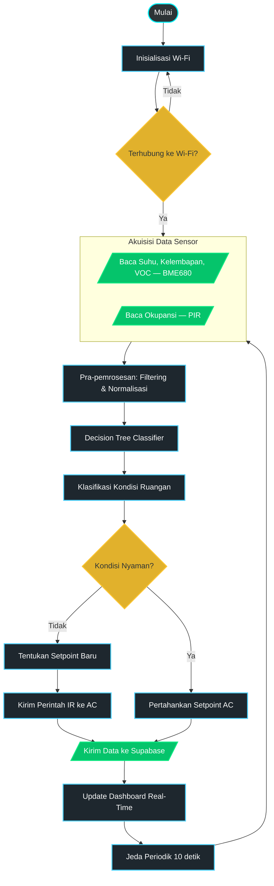

# Smart Compact Climate Controller

> Sistem kendali iklim ruangan otomatis berbasis IoT menggunakan ESP32-C6, sensor BME680, IR Blaster, dan dashboard web real-time yang terhubung ke cloud Supabase.

---

## Daftar Isi

- [Gambaran Sistem](#gambaran-sistem)
- [Arsitektur](#arsitektur)
- [Fitur Utama](#fitur-utama)
- [Hardware](#hardware)
- [Software & Teknologi](#software--teknologi)
- [Struktur Proyek](#struktur-proyek)
- [Skema Database](#skema-database)
- [Cara Menjalankan](#cara-menjalankan)
  - [1. Firmware ESP32](#1-firmware-esp32)
  - [2. Database Supabase](#2-database-supabase)
  - [3. Dashboard Web](#3-dashboard-web)
- [Algoritma Decision Tree](#algoritma-decision-tree)
- [Dukungan Merek AC](#dukungan-merek-ac)
- [Halaman Dashboard](#halaman-dashboard)
- [Konfigurasi Jaringan (OTA via Cloud)](#konfigurasi-jaringan-ota-via-cloud)

---

## Gambaran Sistem

Smart Compact Climate Controller adalah perangkat IoT yang memantau kondisi udara ruangan (suhu, kelembapan, tekanan, VOC, dan deteksi orang) secara real-time dan mengendalikan AC secara otomatis menggunakan sinyal IR. Keputusan pengendalian AC diambil oleh algoritma **Decision Tree** yang berjalan baik di firmware ESP32 maupun di dashboard web.

Data dikirim ke cloud **Supabase** setiap 10 detik, dan perintah balik dari dashboard ke ESP32 dilakukan melalui tabel `device_commands` yang di-poll oleh firmware setiap 5 detik.

---

## Arsitektur



---

## Fitur Utama

| Fitur | Keterangan |
|---|---|
| **Monitoring Real-Time** | Data suhu, kelembapan, tekanan, VOC, dan deteksi gerak ditampilkan live via WebSocket Supabase |
| **Auto-Pilot (Decision Tree)** | Klasifikasi kondisi ruangan otomatis dan penyesuaian setpoint AC tanpa intervensi manual |
| **IR Blaster Multi-Brand** | Mendukung 16+ merek AC dengan protokol IR masing-masing |
| **Remote Kontrol Web** | Antarmuka remote AC dengan circular dial, kontrol mode, dan fan speed |
| **Device Pairing** | Auto-discovery perangkat ESP32 di jaringan yang sama, lalu pairing ke akun pengguna |
| **OTA Wi-Fi Config** | Ganti konfigurasi Wi-Fi ESP32 dari dashboard tanpa sentuh perangkat |
| **Analitik Historis** | Grafik tren sensor dengan filter rentang tanggal |
| **Autopilot Log** | Pencatatan setiap keputusan autopilot untuk analisis performa |
| **PIR Auto-Trigger** | AC dimatikan otomatis jika tidak ada orang selama > 10 menit |

---

## Hardware

| Komponen | Keterangan |
|---|---|
| **ESP32-C6 DevKitC-1** | Mikrokontroler utama dengan Wi-Fi 6 |
| **Adafruit BME680** | Sensor suhu, kelembapan, tekanan, dan VOC gas |
| **PIR Sensor** | Deteksi kehadiran orang (pin GPIO 1) |
| **IR LED** | Transmitter sinyal infrared ke AC (pin GPIO 10) |
| **I2C Bus** | SDA: GPIO 21, SCL: GPIO 20 |

### Skema Pin

```
ESP32-C6
├── GPIO 1   → PIR Sensor (INPUT)
├── GPIO 10  → IR LED Transmitter
├── GPIO 20  → I2C SCL (BME680)
└── GPIO 21  → I2C SDA (BME680)
```

---

## Software & Teknologi

### Firmware (ESP32)
- **Platform**: PlatformIO + Arduino Framework
- **Libraries**:
  - `Adafruit BME680` — sensor environment
  - `Adafruit BusIO` — I2C/SPI abstraction
  - `ArduinoJson ^7.4.2` — serialisasi JSON
  - `IRremoteESP8266 ^2.8.6` — protokol IR multi-brand
  - `PubSubClient ^2.8` — MQTT (optional)
  - `HTTPClient`, `WiFiClientSecure` — komunikasi HTTPS ke Supabase

### Dashboard Web
- **Framework**: Next.js 14 (App Router) + TypeScript
- **Database & Backend**: Supabase (PostgreSQL + Realtime WebSocket + Auth)
- **UI**: Custom CSS Glass-morphism, Recharts untuk grafik
- **Icons**: Lucide React

---

## Struktur Proyek

```
TA_v1/
├── src/
│   ├── main.cpp              # Firmware ESP32 utama
│   └── secrets.h             # Konfigurasi API keys (gitignored)
├── include/
│   └── WebDashboard.h        # HTML dashboard lokal ESP32 (embedded)
├── platformio.ini            # Konfigurasi build PlatformIO
│
├── dashboard/                # Next.js Web Dashboard
│   └── src/app/
│       ├── page.tsx          # Halaman utama: monitoring real-time & device pairing
│       ├── analytics/        # Analitik & grafik historis
│       ├── automation/       # Smart Auto-Pilot & remote manual
│       ├── remote/           # Remote kontrol AC standalone
│       ├── config/           # Konfigurasi Wi-Fi OTA
│       ├── login/            # Autentikasi pengguna
│       ├── api/device/       # API route: pendaftaran perangkat
│       ├── components/
│       │   ├── Sidebar.tsx   # Navigasi sidebar
│       │   └── AuthGuard.tsx # Guard autentikasi halaman
│       └── lib/
│           └── supabaseClient.ts
│
├── supabase/
│   ├── autopilot_setup.sql   # Setup tabel autopilot_log & kolom tambahan
│   ├── autopilot_webhook.sql # Webhook trigger Supabase
│   └── functions/
│       └── autopilot-engine/ # Supabase Edge Function autopilot
│
├── migration.sql             # Migrasi database utama (devices, sensor_data, RLS)
├── fix_rls_and_backfill.sql  # Perbaikan RLS & backfill data historis
├── sql_app_settings.sql      # Setup tabel app_settings
├── flowchart_sistem.md       # Flowchart sistem (Mermaid)
└── wireframes.html           # Wireframe UI (standalone HTML)
```

---

## Skema Database

Jalankan `migration.sql` di Supabase SQL Editor untuk membuat semua tabel.

### Tabel Utama

```sql
-- Registrasi perangkat ESP32
devices (
  mac_address   TEXT PRIMARY KEY,
  device_name   TEXT NOT NULL,
  owner_id      UUID → auth.users,
  paired_at     TIMESTAMPTZ,
  last_ip       TEXT,
  status        TEXT DEFAULT 'offline',
  last_seen     TIMESTAMPTZ,
  created_at    TIMESTAMPTZ
)

-- Data sensor dikirim setiap 10 detik
sensor_data (
  id          BIGSERIAL PRIMARY KEY,
  mac_address TEXT → devices,
  temperature FLOAT,
  humidity    FLOAT,
  pressure    FLOAT,
  voc         FLOAT,
  pir         INTEGER,
  created_at  TIMESTAMPTZ
)

-- Antrian perintah dari dashboard ke ESP32
device_commands (
  id          BIGSERIAL PRIMARY KEY,
  mac_address TEXT → devices,
  command     TEXT,   -- 'SET_AC' | 'AC_ON' | 'AC_OFF' | 'SET_WIFI'
  payload     TEXT,   -- JSON string
  status      TEXT DEFAULT 'pending',
  created_at  TIMESTAMPTZ
)

-- Pengaturan aplikasi per perangkat
app_settings (
  id                  INTEGER PRIMARY KEY,
  mac_address         TEXT,
  auto_mode           BOOLEAN DEFAULT false,
  pir_auto_mode       BOOLEAN DEFAULT false,
  last_comfort_status TEXT,
  last_command_at     TIMESTAMPTZ
)

-- Log keputusan autopilot (untuk analisis)
autopilot_log (
  id               BIGSERIAL PRIMARY KEY,
  mac_address      TEXT,
  temperature      FLOAT,
  humidity         FLOAT,
  voc              FLOAT,
  pir              INTEGER,
  comfort_status   TEXT,   -- 'Nyaman' | 'Kurang Nyaman' | 'Tidak Nyaman'
  ac_command       TEXT,
  no_motion_minutes FLOAT,
  action_taken     TEXT,   -- 'command_sent' | 'skipped_identical' | 'ac_off'
  created_at       TIMESTAMPTZ
)
```

Row Level Security (RLS) aktif di semua tabel — user hanya bisa mengakses data dari perangkat yang ia miliki.

---

## Cara Menjalankan

### 1. Firmware ESP32

**Prasyarat**: PlatformIO CLI atau VS Code + PlatformIO extension.

1. Clone repositori dan buka di VS Code.
2. Buat file `src/secrets.h` berisi:

```cpp
// src/secrets.h
#pragma once

const char* supabase_url      = "https://<PROJECT_ID>.supabase.co/rest/v1/sensor_data";
const char* supabase_device_url = "https://<PROJECT_ID>.supabase.co/rest/v1/devices";
const char* supabase_cmd_url  = "https://<PROJECT_ID>.supabase.co/rest/v1/device_commands";
const char* supabase_key      = "<SUPABASE_ANON_KEY>";
```

3. Hubungkan ESP32-C6 ke USB, lalu upload:

```bash
pio run --target upload
pio device monitor --baud 115200
```

4. Saat pertama kali boot, ESP32 akan mencoba konek ke Wi-Fi default (`BURJO`). Jika gagal, akan membuat hotspot **ClimateController** (password: `12345678`).

---

### 2. Database Supabase

1. Buat project baru di [supabase.com](https://supabase.com).
2. Buka **SQL Editor** dan jalankan script berikut secara berurutan:

```
migration.sql           ← Tabel utama + RLS
sql_app_settings.sql    ← Tabel app_settings
supabase/autopilot_setup.sql  ← Tabel autopilot_log
fix_rls_and_backfill.sql      ← Perbaikan RLS (jika diperlukan)
```

3. Aktifkan **Realtime** pada tabel `sensor_data`, `device_commands`, dan `app_settings` di menu **Database → Replication**.

---

### 3. Dashboard Web

**Prasyarat**: Node.js 18+

```bash
cd dashboard
npm install
```

Buat file `.env.local`:

```env
NEXT_PUBLIC_SUPABASE_URL=https://<PROJECT_ID>.supabase.co
NEXT_PUBLIC_SUPABASE_ANON_KEY=<SUPABASE_ANON_KEY>
```

Jalankan development server:

```bash
npm run dev
```

Buka [http://localhost:3000](http://localhost:3000).

Untuk production build:

```bash
npm run build
npm start
```

---

## Algoritma Decision Tree

Klasifikasi kondisi ruangan menggunakan dua fitur utama: **humidity** dan **temperature**.

```
IF humidity <= 65.03:
    → "Nyaman"       → AC mode: fan, suhu 26°C, kipas auto

ELSE IF temperature <= 31.99:
    → "Kurang Nyaman" → AC mode: cool, suhu 24°C, kipas auto

ELSE:
    → "Tidak Nyaman"  → AC mode: cool, suhu 18°C, kipas high
```

**Logika tambahan (PIR):**
- Tidak ada gerakan selama ≥ 10 menit → AC dimatikan otomatis.
- Seseorang baru terdeteksi masuk → AC dihidupkan kembali (PIR Auto-Trigger).

Algoritma ini berjalan di dua tempat:
1. **Dashboard web** (`automation/page.tsx`) — mengirim perintah ke ESP32 via Supabase.
2. **Firmware ESP32** (`main.cpp`) — eksekusi lokal perintah IR.

---

## Dukungan Merek AC

Firmware mendukung protokol IR untuk merek-merek berikut:

| Merek | Merek | Merek | Merek |
|---|---|---|---|
| SHARP (A705/A903/A907) | GREE | MIDEA | SAMSUNG |
| DAIKIN | FUJITSU | HAIER | HITACHI |
| LG | MITSUBISHI Electric | MITSUBISHI Heavy | PANASONIC |
| SANYO | TCL | TOSHIBA | WHIRLPOOL |

Model AC dapat diatur dari:
- **Dashboard** → halaman Remote Kontrol → dropdown "Target AC"
- **Web lokal ESP32** → `http://<IP_ESP32>/`

---

## Halaman Dashboard

### Ringkasan Real-Time (`/`)
- Status kondisi ruangan (Nyaman / Kurang Nyaman / Tidak Nyaman)
- Kartu sensor: suhu, kelembapan, tekanan, VOC, deteksi gerak
- Auto-discovery dan pairing perangkat ESP32
- Indikator online/offline perangkat

### Analitik & Historis (`/analytics`)
- Grafik tren suhu, kelembapan, VOC, dan tekanan
- Filter rentang tanggal
- Statistik rata-rata per periode

### Smart Auto-Pilot (`/automation`)
- Toggle Master Switch auto-pilot (Decision Tree aktif)
- Status komfort terakhir dan tindakan yang diambil
- Remote kontrol manual dengan circular dial saat auto-pilot mati
- Toggle PIR Auto-Trigger

### Remote Kontrol AC (`/remote`)
- Antarmuka remote AC mandiri dengan circular temperature dial
- Pilih merek AC, mode (cool/dry/fan/heat), dan kecepatan kipas

### Konfigurasi Jaringan (`/config`)
- Ganti Wi-Fi ESP32 via cloud (direkomendasikan) atau langsung via HTTP

---

## Konfigurasi Jaringan (OTA via Cloud)

Metode **Via Cloud** (direkomendasikan):
1. Buka halaman **Konfigurasi Jaringan** di dashboard.
2. Masukkan SSID dan password Wi-Fi baru.
3. Klik **Kirim via Cloud**.
4. ESP32 akan mengambil perintah `SET_WIFI` saat polling berikutnya (~5 detik) dan restart otomatis.

Metode **Via Langsung** (fallback):
1. Jika ESP32 gagal konek ke Wi-Fi, ia membuat hotspot **ClimateController** (password: `12345678`).
2. Hubungkan laptop/HP ke hotspot tersebut.
3. Buka dashboard, pilih **Via Langsung**, masukkan IP `192.168.4.1`.
4. Kirim konfigurasi Wi-Fi baru.

---

## Lisensi

Proyek ini dibuat untuk keperluan Tugas Akhir. Seluruh kode dapat digunakan dan dimodifikasi untuk keperluan akademis.
