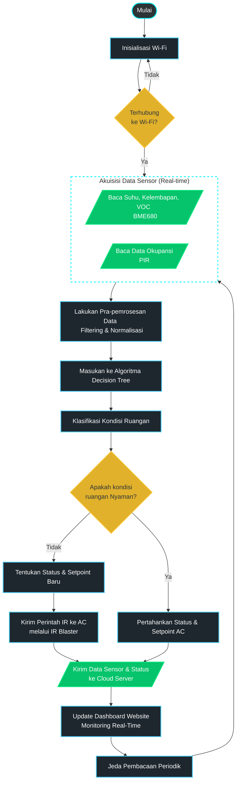

```mermaid
flowchart TD
    %% Styling
    classDef startEnd fill:#2d3436,stroke:#00f2fe,stroke-width:2px,color:#fff;
    classDef process fill:#1e272e,stroke:#4bcffa,stroke-width:2px,color:#fff;
    classDef decision fill:#e1b12c,stroke:#fbc531,stroke-width:2px,color:#2d3436;
    classDef io fill:#05c46b,stroke:#0be881,stroke-width:2px,color:#fff;
    classDef subgraphStyle fill:transparent,stroke:#00f2fe,stroke-width:2px,stroke-dasharray: 5 5;

    %% Nodes
    Start([Mulai]):::startEnd --> InitWiFi[Inisialisasi Wi-Fi]:::process
    InitWiFi --> CheckWiFi{Terhubung <br> ke Wi-Fi?}:::decision
    CheckWiFi -- Tidak --> InitWiFi
    
    CheckWiFi -- Ya --> ParRead

    subgraph ParRead ["Akuisisi Data Sensor (Real-time)"]
        direction LR
        ReadBME[/Baca Suhu, Kelembapan, VOC <br> BME680/]:::io
        ReadPIR[/Baca Data Okupansi <br> PIR/]:::io
    end
    
    class ParRead subgraphStyle;

    ParRead --> Preprocess[Lakukan Pra-pemrosesan Data <br> Filtering & Normalisasi]:::process
    Preprocess --> ToDT[Masukan ke Algoritma Decision Tree]:::process
    ToDT --> Classify[Klasifikasi Kondisi Ruangan]:::process
    
    Classify --> CheckComfort{Apakah kondisi<br>ruangan Nyaman?}:::decision
    
    %% The corrected logic
    CheckComfort -- Ya --> Maintain[Pertahankan Status & Setpoint AC]:::process
    CheckComfort -- Tidak --> NewSetpoint[Tentukan Status & Setpoint Baru]:::process
    
    NewSetpoint --> SendIR[Kirim Perintah IR ke AC<br>melalui IR Blaster]:::process
    
    %% Both paths now go to the Cloud!
    SendIR --> SendCloud
    Maintain --> SendCloud[/Kirim Data Sensor & Status <br> ke Cloud Server/]:::io
    
    SendCloud --> UpdateWeb[Update Dashboard Website <br> Monitoring Real-Time]:::process
    
    %% Loop back
    UpdateWeb --> Delay[Jeda Pembacaan Periodik]:::process
    Delay --> ParRead
```
